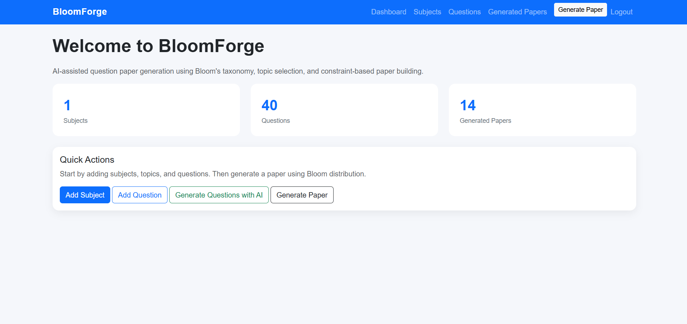
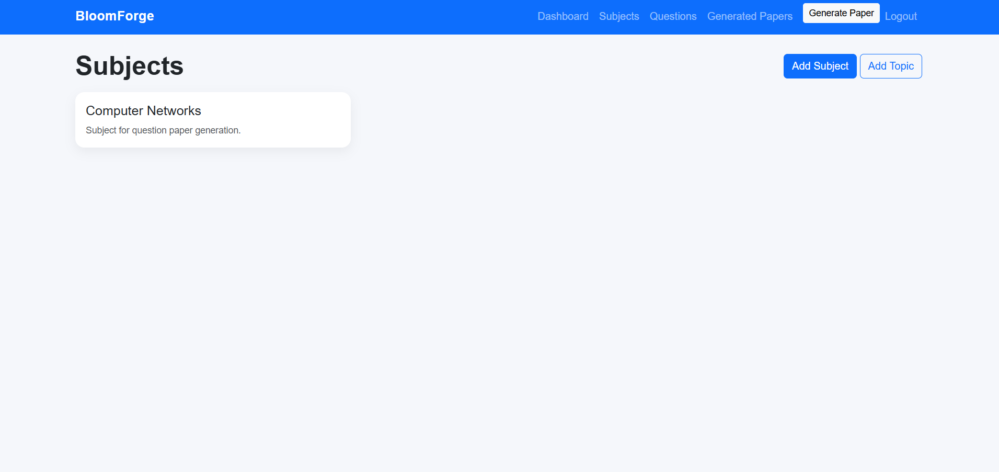
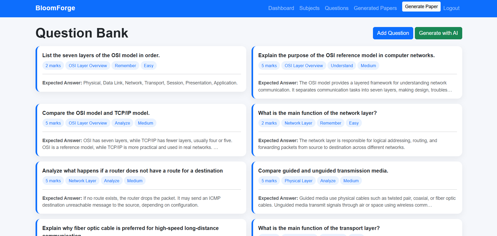
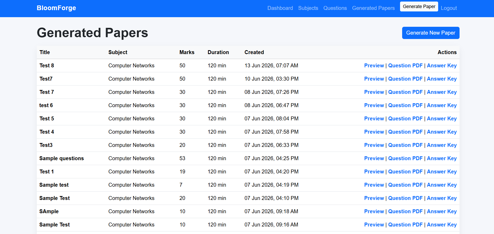
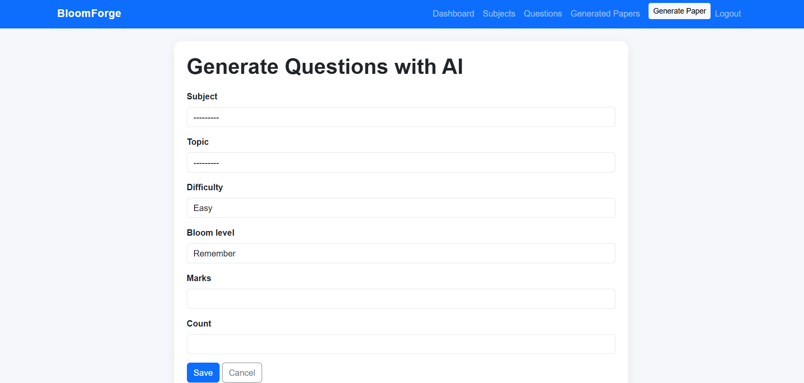
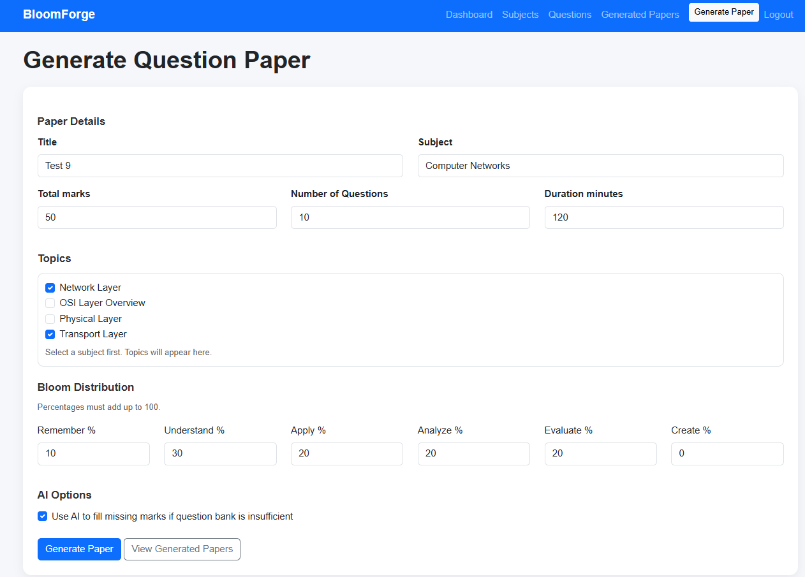
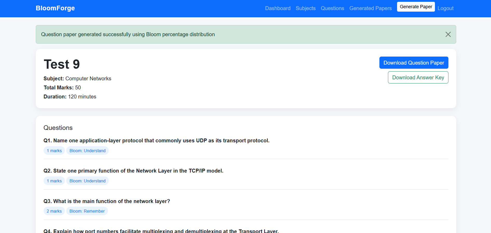

# BloomForge

Question Paper Generator using Bloom's Taxonomy assisted by AI.

## Live Demo

Deployed on Render:  
https://questionpapergenerator-8135.onrender.com

Demo usage:
- Register a new account
- Add subjects and topics
- Add or generate questions
- Generate a question paper
- Download question paper and answer key PDFs

## Features

- User registration, login, and logout
- Subject and topic management
- Question bank with marks, difficulty, and Bloom level
- AI-based question generation using Gemini
- Rule-based paper generation
- Topic-wise question selection
- Bloom taxonomy percentage distribution
- Total marks and number of questions control
- AI fill for missing constraints
- Generated paper history
- Question paper PDF export
- Answer key PDF export
- Bootstrap-based responsive UI

## Tech Stack

- Python
- Django
- SQLite
- HTML, CSS, Bootstrap
- JavaScript / AJAX
- Gemini API
- ReportLab
- Render

## How It Works

The system first tries to generate the question paper using a rule-based selection algorithm from the existing question bank. The teacher provides total marks, number of questions, selected topics, and Bloom taxonomy distribution.

If the question bank cannot satisfy the exact constraints, the AI fill feature generates only the missing or replacement questions. The final paper is validated before being saved.

## AI Fill Logic

AI is not used to blindly generate the entire paper. It is used as a fallback mechanism.

Example:

Requested:
- 50 marks
- 10 questions

Generated from question bank:
- 48 marks
- 10 questions

Since the question count is already full but marks are short, the system removes one selected question, recalculates the missing marks and question count, asks Gemini to generate a replacement question, and then validates the final paper.

## Screenshots

### Dashboard

### Subjects List

### Question Bank

### Papers List

### AI Question Generation

### Paper Generation

### Paper Preview

## Limitations

- The paper generation algorithm is greedy, not fully optimized.
- AI-generated questions may require teacher review.
- Free Render deployment may sleep after inactivity.
- This is an interview/demo-level deployment, not production-grade.

## Future Improvements

- Teacher review before saving AI-generated questions
- Better search and filtering in question bank
- More advanced optimization for paper generation
- Test suite for generator logic
- Role-based access control
- Analytics for question usage
